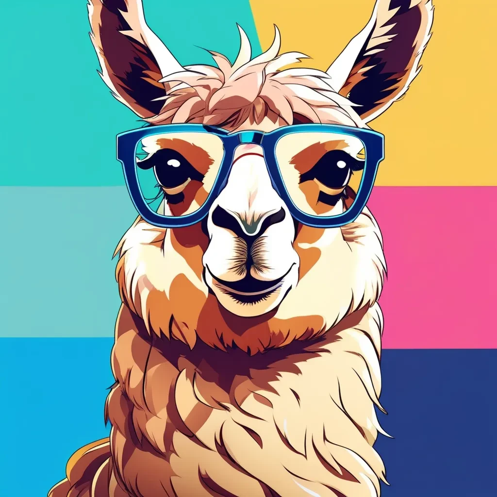
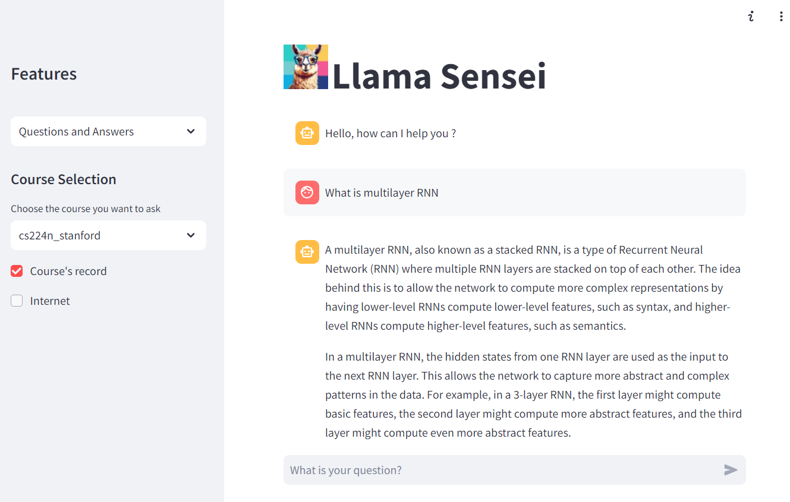
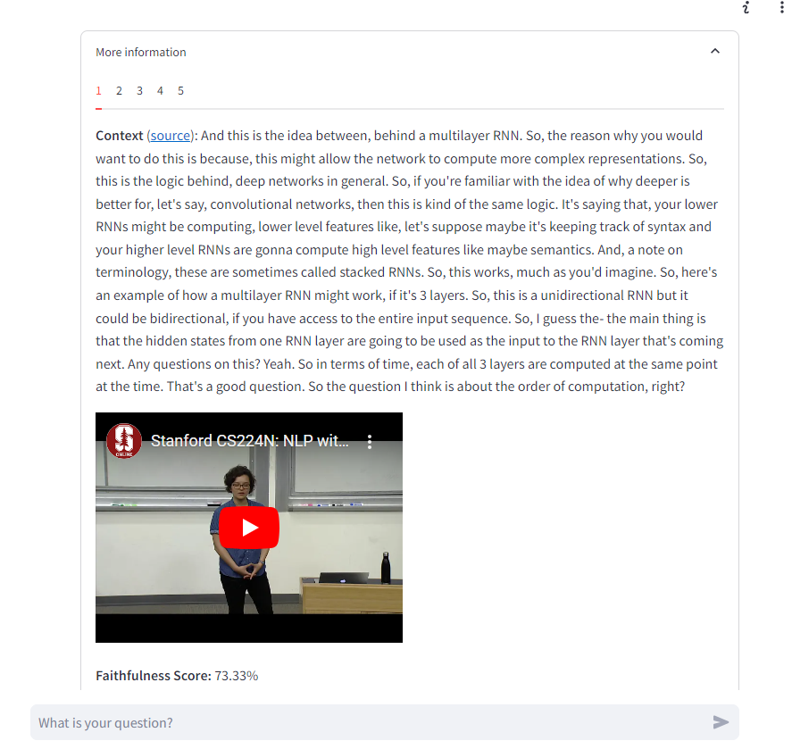
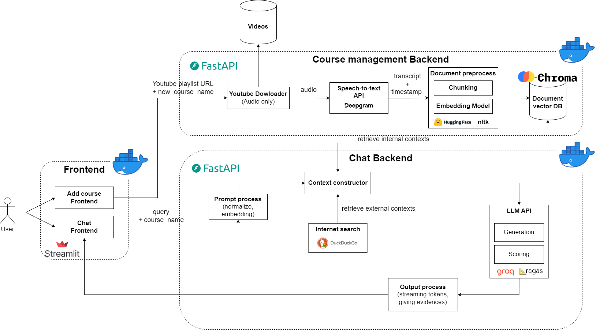
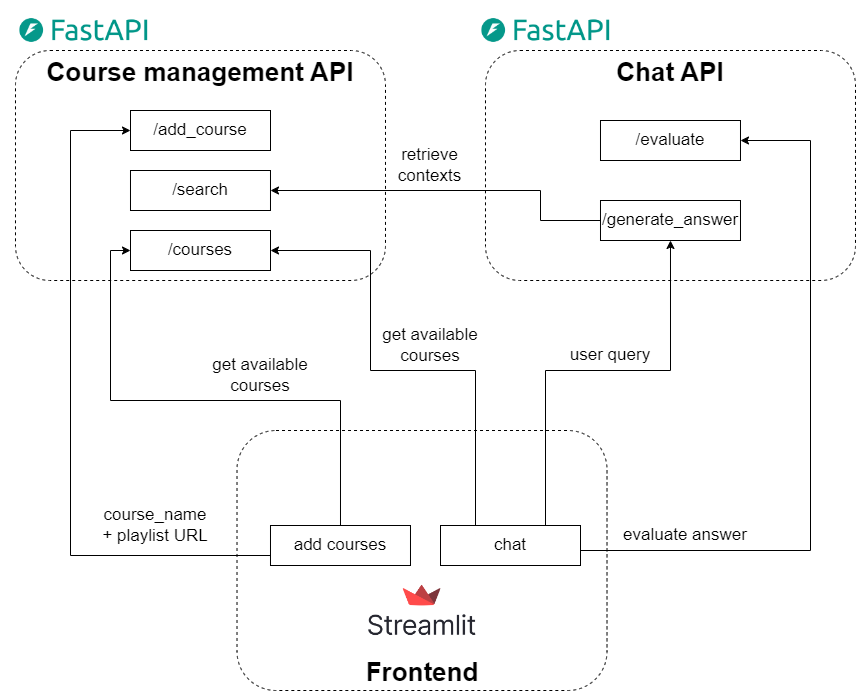

# Llama Sensei: An AI-Powered Learning Assistant

<p align="center">
  
</p>

## Introduction

**Llama Sensei** is a Chatbot application designed to enhance the learning experience by providing instantaneous answers to users' questions about their lecture content on online learning platform (e.g. Youtube). It leverages Large Language Models (LLM) and Retrieval-Augmented Generation (RAG) to ensure accurate and relevant information is delivered. Additionally, it provides precise links to the reference source that RAG uses, enhancing transparency and trust in the provided answers.

## Table of Contents

- [Introduction](#introduction)
- [Overview](#overview)
- [Installation](#installation)
- [Usage](#usage)
- [Project Structure](#project-structure)
- [Contributing](#contributing)
- [Credits](#credits)

## Overview

### User interface


 | 
:-------------------------:|:-------------------------:

### Features

**Llama Sensei** offers two main features: **Chat** and **Add New Course**.

#### Chat

- **Context Retrieval**: Retrieve context from either the selected course or the internet, or both, to provide relevant answers.
- **Reference Linking**: Display reference links retrieved from the knowledge base and web search results, including precise timestamps for video content (e.g., specific segments in YouTube videos).
- **Automated Answer Grading**: Answers are automatically graded by our application to assess their relevance and reliability.

#### Add New Course

- **Create New Course**: Easily create a new course within the application by providing the course's URL (**Currently we only support Youtube playlist URLs**)
- **Add Videos**: Add new videos to an existing course, allowing for continuous updates and expansion of course content.

### Technologies Used

- **Youtube lecture video crawling**: download youtube video playlist that contain lecture videos using [yt-dlp](https://github.com/yt-dlp/yt-dlp).
- **Speech-to-Text**: transcribe lecture videos into transcripts with specific timestamp using [Deepgram API](https://deepgram.com/).
- **Text Processing**: preprocess and handle text data using [NLTK](https://www.nltk.org/api/nltk.html).
- **Text Embedding**: embed text data using [sentence_transformers](https://huggingface.co/sentence-transformers).
- **Vector Database**: store and retrieve encoded lecture transcripts for RAG using [ChromaDB](https://docs.llamaindex.ai/en/stable/getting_started/starter_example/).
- **Internet context search**: retrieve the external context from internet for RAG using [Duckduckgo](https://duckduckgo.com/).
- **LLM API**: use [Groq](https://groq.com/) for fast LLM inference with various models (Llama, Mistral, etc.) and real-time answer streaming.
- **Scoring and Evaluation**: use [Ragas](https://ragas.io/) framework to evaluate RAG pipeline and LLM answer.
- **User Interface**: implement interactive front-end using [Streamlit](https://streamlit.io/).
- **Backend APIs**: implement back-end APIs using [FastAPI](https://fastapi.tiangolo.com/).
- **Containerization**: use [Docker](https://www.docker.com/) for easy deployment.

### Overall architecture design



## Installation

This project supports deployment using `docker compose`. To run the application locally, follow these steps:

1. **Clone the repository**:
   ```bash
   git clone https://github.com/Croissant-Team-Cinnamon-Bootcamp-2024/FinalProject.git llama-sensei
   cd llama-sensei
   ```

2. Get the API keys and fill the environment variables in `.env.example` file and **rename the file to `.env`**:
   - DG_API_KEY: get from https://deepgram.com/
   - GROQ_API_KEY: get from https://groq.com/

3. Start the application by running the following command::
    ```bash
    docker compose up -d
    ```

4. When the service `course_management_api` is building, the yt-dlp will ask you to give authorization with this notification:
    ```
    [youtube+oauth2] To give yt-dlp access to your account, go to https://www.google.com/device and enter code XXX-YYY-ZZZ
    ```
    Follow the provided link and enter the code, this will give yt-dlp allowance to download youtube lecture videos.
  
5. Wait until all the services are running and go to `localhost:8081` and enjoy!

6. (Optional - for demo purpose) Download the [processed course transcript (stanford cs229) here](https://drive.google.com/drive/folders/1uDL-VKjL2OJMxMTq-ptheb7c49aAhS6o?usp=sharing) and add the course to database by running the following command (please change the path to the transcript inside the python script file `scripts/create_collection.py` first):
    ```bash
    python scripts/create_collection.py
    ```

## Usage

### Adding a Course

1. Navigate to the "Add Course" page in the application.
2. Upload course materials by providing URL to the resources.
3. Check your content before add to database and press Submit.
4. The application will process and store the course content for future queries.

### Asking Questions

1. Go to the "QA" section.
2. Select a course from the database.
3. Select retrieve context from either internal database (added lectures) or from internet, or from both.
4. Enter your question and submit.
5. View the AI-generated answer along with references from the knowledge base or external resources.

## API Endpoints



## Project Structure

The project structure is organized as follows:

```
📦 llama-sensei
├─ .github/ # For Github Actions configuration
│  └─ ...
├─ app/
│  └─ llama_sensei/
│     ├─ backend/
│     │  ├─ add_courses/
│     │  └─ qa/
│     └─ frontend/
│        ├─ pages/
│        └─ main.py
├─ assets/
│  └─ ...
├─ scripts/
│  └─ ...
├─ tests/
│  └─ unit/
├─ .env.example # example environment variables
├─ .pre-commit-config.yaml
├─ README.md
├─ docker-compose.yaml
├─ requirements-dev.txt
└─ setup.py
```

## Contributing

If you find any issues or have suggestions for improvements, please feel free to open an issue.

### Future roadmap

- Technical:
  - Optimize the efficienty of the models and latency (which we did not technically measure)
- More features: 
  - Implement better User Interface (e.g. using React)
  - Save answer history
  - Get user feedback: Like/dislike button for app evaluation

### Code Quality

We maintain high code quality standards through:
- Continuous Integration (CI)
- Coding conventions
- Docstrings
- Pre-commit hooks
- Unit testing

## Credits

This project was developed by @Croissant team.
